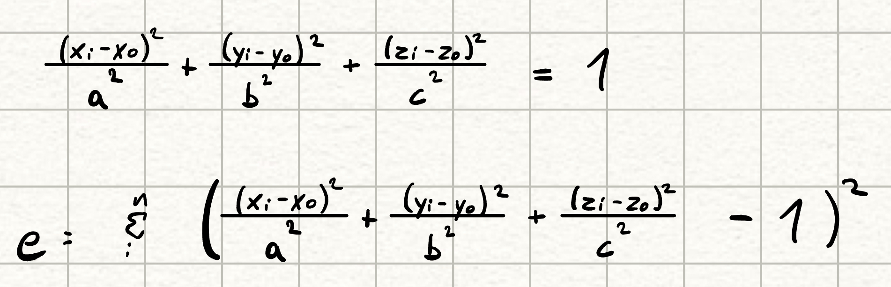
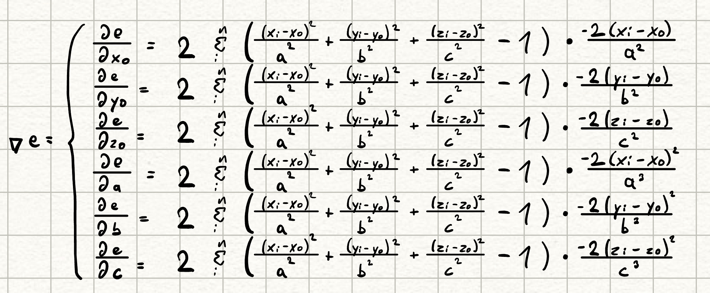

# magCalibration
A repo for my tries and problems of implementing a magnetometer calibration algorithm.

## The Problem

While implementing a sensor fusion filter using an accelerometer, gyroscope and magnetometer, I found the mag to be unreliable. 
This is most likely because of the lack of calibration. So I set out to write an algorithm to do just that.

An uncalibrated mag readings when turning the sensor around all axis give an ellipsoid (soft iron error) with an offset center (hard iron error). But the result of reading the sensor is just a point cloud. To get the parameters of center offset and the three radii, a best fitting ellipsoid has to be found from the point cloud.

## The Solution

One of the most versatile optimization algorithms seems to be gradient descent.
For the ellipsoid 6 parameters are necessary.
- x0 - the x component of the center
- y0 - the y component of the center
- z0 - the z component of the center
- a - the radius in the x direction
- b - the radius in the y direction
- c - the radius in the z direction

For gradient descent an error (or loss) function has to be defined. In this case I started with the general formula for an ellipsoid. Then I changed it to be a difference (or residual), which I squared and took the sum of. Leading to the following:

As the name implies the gradient descent algorithm needs the gradient of the loss function. 

Then I went about implementing it in c++ so it could run on the arduino device to which the mag sensor was attached.
The code can be found in (LINK !!!)
To run it use the command `COMMAND!!!`